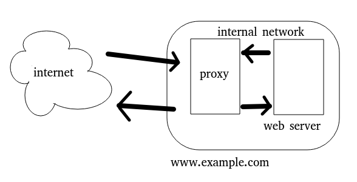

# Khái niệm chuyên môn
## Tổng quan SSL
SSL được viết tắt từ __Sercure Sockets Layer__, là một tiêu chuẩn bảo bật công nghệ, tạo ra liên kết giữa máy chủ web và trình duyệt. Nó giúp đảm bảo các dữ liệu trao đổi giửa 2 phía luôn được an toàn.

Ngoài ra khi sử dụng thì mọi dữ kiệu trao đổi giữa người nhận và website hau người gửi đều được bảo vệ bở cơ chế mạnh mẽ nhất hiện tại, được hàng triệu khách hàng tin tưởng và sử dụng hơn.

SSL sẽ giúp bảo mật các giao dịch giữa khách hàng và doanh nghiệp, các dịch vụ truy nhập hệ thống trang web và các ứng dụng như Outlook Web Access, Exchange, và Office Communication Server,... và còn bảo mật cả các ứng dụng ảo hóa hoặc các ứng dụng điện toán đám mây (cloud)
### Phân loại SSL
1. DV-SSL: domain validation

Dành cho khách hàng cá nhân, cấu hình cơ bản và giá rẻ

Chỉ yêu cầu quyền sở hữu domain và thời gian đăng ký, thời gian xác minh ngắn

Ngoài ra, các website của khách hàng sẽ được kích hoạt trạng thái __"khóa an toàn"__, đảm bảo an toàn cho các giao dịch thương mại điện tử, thông tin đăng nhập tài khoản web, email trực tuyến, lưu lượng mạng và dịch vụ trực tuyến

2. OV-SSL: organization validation

Dành cho khách hàng thuộc tệp tổ chức, văn phòng, công ty, doanh nghiệp, tập đoàn,... có độ tin cậy cao

OV-SSL sẽ chứng thực, xác minh website cũng như doanh nghiệp sở hữu website đó

Các website của khách hàng sẽ được kích hoạt trạng thái __"khóa an toàn"__, đảm bảo an toàn cho các giao dịch thương mại điện tử, thông tin đăng nhập tài khoản web, email trực tuyến, lưu lượng mạng và dịch vụ trực tuyến

3. EV-SSL: extent validation

EV-SSL tuân thủ nghiêm ngặt các quy định của tổ chức CA-Browser Forum trong quá trình xác minh doanh nghiệp. Khi người dùng truy cập vào các website được trang bị EV-SSL, thanh địa chỉ của browser sẽ chuyển sang màu xanh lá cây, đồng thời hiển thị tên doanh nghiệp sở hữu website đó. Điều này giúp gia tăng độ tin cậy của website đó đối với người dùng.

4. Wildcard SSL Certificate

Chuyên dành cho các website có nhu cầu sử dụng SSL cho nhiều subdomain khác nhau. Wildcard SSL khác với các loại SSL bình thường là có thể chạy cho không giới hạn tên miền phụ với một chứng chỉ SSL duy nhất

5. SANS:

Được thiết kế cho các ứng dụng Communication của Microsoft như Microsoft Exchange Server, Microsoft Office Communications, Lync và cũng là giải pháp tiết kiệm cho các môi trường khác như Share Hosting & QA Testing. Lựa chọn thêm SANs cho phép bảo mật tới 40 tên miền và máy chủ chỉ với một chứng thư số. Ngoài ra, SANs còn mang lại sự linh hoạt cho người sử dụng, dễ dàng hơn trong việc cài đặt, sử dụng và quản lý chứng thư số SSL. 

Ngoài ra còn có MDC-SSL (chứng chỉ đa miền) và UCC-SSL (truyền thông hợp nhất) 
### Sự thay thế
Công nghệ này đang lỗi thời và được thay thế hoàn toàn bởi TLS.

TLS là chữ viết tắt của __Transport Layer Security__, nó cũng giúp bảo mật thông tin truyền giống như SSL. Nhưng vì SSL không còn được phát triển nữa, nên TLS mới là thuật ngữ đúng nên dùng.

Về cơ bản SSL và TSL ko quá khác nhau trừ cách gọi tên, các cơ chế hoạt động gần như không đổi
### Vai trò của SSL với 1 trang web
Mã hóa thông tin: các dữ liệu, thông tin trong quá trình truyền giữa browser và server được bảo vệ an toàn, tránh các tình huống huống xâm phạm, phá hoại, đánh cắp từ kẻ tấn công
Nâng cao tính xác thực trang web: hạn chế thông tin sai sót và truyền đi lung tung trong quá trình truyền giữa server tới browser được chỉ định, các thông tin đó sẽ chỉ có các bên được xác định mới có thể đọc được
Gia tăng độ tin cậy cho khách hàng: khách hàng sẽ không muốn truy cập, trao đổi thông tin với trang web bị gán cảnh báo không an toàn, nếu được trang bị SSL, khách hàng sẽ yên tâm hơn khi lựa chọn truy cập trang web, chọn lọc thông tin và tải xuống
Nâng cao, tối ưu vị trí tìm kiếm trên bảng xếp hạng: Với vị trí càng cao trên bảng tìm kiếm sẽ là lợi thế với các trang web có SSL. Ở góc độ doanh nghiệp thì điều này giúp tiếp cận các tệp khách hàng hiệu quả cũng như chuyển đổi khách hàng tiềm năng thành khách hàng thực tế. 
Điều kiện tiêu chuẩn cho các trang web có tính năng thanh toán trực tiếp (PCI compliance). Các trang web thu thập thông tin khách hàng, số tài khoản ngân hàng, thẻ tín dụng,.... đều cần có chứng chỉ SSL hợp lệ để  có thể tiếp nhận thông tin khách hàng  
### Các chú ý khi đăng ký SSL
Giá thành: với đối tượng khách hàng cá nhân hay doanh nghiệp vừa và nhỏ thì 1 chứng chỉ SSL giá thành thấp nhưng hiệu suất bảo mật vẫn phải tối ưu là điều cần thiết để cân bằng chi phí
Gia hạn chứng chỉ: tất cả chứng chỉ SSL đều có thời hạn, thông thường SSL sẽ hết hiệu lực sau 1 năm kể từ ngày kích hoạt, do đó cần lưu ý về thời hạn SSL, để  tránh việc trang web có nhiều lỗ hổng cho cả người dùng lẫn doanh nghiệp dễ bị kẻ xấu lợi dụng.
Sử dụng HTTPS: https bảo mật hơn giap thức cũ là http ở việc có thêm  SSL, 2 công nghệ này luôn đi liền với nhau và trở thành tiêu chuẩn mới cho website hiện nay đều yêu cầu sử dụng giao thức HTTPS thay vì giao thức cũ
Số lượng tên miền: như đã nêu rằng có SSL dơn miền và SSL đa miền, trừ khi khách hàng có dự dịnh mở rộng tên miền trong tương lại thì việc lựa chọn SSL đợn miền cũng là 1 cách để tối ưu chi phí cho bản thân
Loại SSL: tùy theo qui mô doanh nghiệp sẽ lựa chọn loại SSL tương ứng. Tăng độ tin cậy trong mắt khách hàng cũng là 1 cách tăng độ uy tín doanh nghiệp, chứng chỉ xác thực càng cao cấp thì độ bảo vệ cũng như đảm bảo quyền lợi, kể cả giá thành cũng cao theo 
### Cơ chế hoạt động của SSL
SSL hoạt động dựa trên mã khóa public khi user sử dụng 1 dịch vụ có SSL hỗ trợ như truy cập 1 website

Mã khóa này có 2 phần là private key và public key để truyền dữ liệu giữa 2 hệ thống:

client truy cập dịch vụ của server có SSL, ứng dụng dịch vụ yêu cầu lấy public key từ server đổi với key của chính client
client nhận public key từ server, giải mã và gửi lại key mã hóa vừa tạo về lại server
server nhận kkey và giải mã, sau đó gửi cả key và nội dung được mã hóa về  client
client nhận packet, giải mã nội dung vừa nhận, hoàn tất bước "bắt tay SSL/TLS"
### Thành phần chung của SSL
CSR (Certificate Signing request): Là 1 đoạn text chứa thông tin của chủ sở hữu tên miền được mã hóa. Thông tin này được gửi đến nhà cung cấp dịch vụ SSL

CRT (Certificate): phần kết quả được trả về website từ SSL provider sau khi nhận CSR

Private key: được sinh ra cùng lúc CRT, CRT được mã hóa khi đưa về browser và phần key này dùng để giải mã thông tin mã hóa của CRT

CA (Certificate Authority): tổ chức cung cấp thong tin SSL
### Các giao thức con của SSL
SSL Handshake Protocol. (được dùng phổ biến)
SSL Change Cipher Spec Protocol.
SSL Alert Protocol.
SSL Record Protocol.
### Các thuật toán mã hóa dùng trong SSL
Một số thuật toán SSL sử dụng:

DES (Data Encryption Standard) là một thuật toán mã hoá có chiều dài khoá là 56 bit.
3-DES (Triple-DES): là thuật toán mã hoá có độ dài khoá gấp 3 lần DES
DSA (Digital Signature Algorithm): là một phần trong chuẩn về xác thực số đang được được chính phủ Mỹ sử dụng.
EA (Key Exchange Algorithm) là một thuật toán trao đổi khoá đang được chính phủ Mỹ sử dụng.
MD5 (Message Digest algorithm) được phát thiển bởi Rivest.
RSA: là thuật toán mã hoá công khai dùng cho cả quá trình xác thực và mã hoá dữ liệu được Rivest, Shamir, and Adleman phát triển.
RSA key exchange: là thuật toán trao đổi khoá dùng trong SSL dựa trên thuật toán RSA.
RC2 and RC4: là các thuật toán mã hoá được phát triển bởi Rivest dùng cho RSA Data Security.
SHA-1 (Secure Hash Algorithm): là một thuật toán băm đang được chính phủ Mỹ sử dụng.
## Tổng quan về Domain
Domain là tên miền của 1 trang web hay còn gọi là địa chỉ trang web, định danh trang web đó chính xác theo tìm kiếm của người dùng

Domain có 2 cấp là 2 cấp chính là 1 cấp phụ 
### Cấu trúc của domain
Tối thiểu 1 tên miền có 2 phần là tên miền cấp cao và tên miền cấp 2

Ngoài ra có thêm subdomain mà dễ thấy nhất là "www"-world wide web
### Cách hoạt động của domain
Khi 1 user muốn truy cập vào 1 địa chỉ cụ thế, tên miền chính là đường đi ngắn nhất để đến website đó

Nếu DNS server gần nhất chưa được quảng bá tên miền trên vào bảng ghi nhớ, nó sẽ tìm hỏi ở các DNS server khác gần nó nhất và tiến trình lặp lại đến khi có 1 DNS server nào đó biết hoặc có được thông tin về domain này, sau đó từ client user sẽ tìm đường đi ngắn nhất kết nối đến website đó thông qua DNS server vừa tìm được, trong khi đó các server chưa có thông tin trước đó sẽ lưu lại vào database của mình 

** Trong trường hợp không có tên domain thì chỉ có thể truy cập website thông qua IP của máy chủ đó **
### Phân loại domain
1. TLD-Top level domain

Là tên miền cấp cao nhất đứng sau dấu chấm đầu tiên và gần như bao gồm mọi domain hiện có, được dùng phổ biến nhất như ".com" ".org" ".gov" ".edu" ".info" ".net" ...

2. ccTLD: country-code top-level-domain

Là tên miền cấp cao dành riêng cho từng quốc qia cụ thể như Mỹ(.us) hay Pháp(.fr), chúng còn được các doanh nghiệp lớn hay tập đoàn đa quốc gia sử dụng cho từng site cụ thể ở các thị trường nhất định

3. gTLD: generic top-level-domain

Nhóm tên miền này được xem là domain cấp cao của chung không thuộc riêng của hội nhóm hay tổ chức, chính phủ quốc gia nào mà là hướng đến 1 lĩnh vực, mục đích cụ thế. Ví dụ như giáo dục(.edu)

4. sTLD

Sponsored top-level domain là tiên miền cấp cao nhất được tài trợ, các tên miền cấp này bị giới hạn như (.mil), (.gov). Ngoài ra, còn có một số tên miền khác cũng đại diện cho sTLD, chẳng hạn như (.edu) – dành cho tổ chức giáo dục, (.asia) – dành cho các công ty tại thị trường Châu Á hay (.post) – dành cho bưu chính viễn thông,...

5. uTLD

Ngược lại với sTLD thì uTLD không được tài trợ sử dụng chủ yêu cho mục đích chia sẻ thông tin chung như các đầu báo tin tức online (.info)

6. iTLD

Viết đầy đủ là Infrastructure top-level domain, là tên miền (.arpa). Đây là tên miền đại diện cho ARPA và chỉ dành riêng cho ICANN dùng để giải quyết các vấn đề về cơ sở hạ tầng internet.

### Phân biệt chuyển và trỏ domain
|Chuyển domain|trỏ domain|
|-----|-----|
|transfer domain|point domain|
|__Transfer domain__ là thao tác nhà cung cấp chuyển quyền quản lý tên miền đến nhà cung cấp khác. Chuyển tên thường thường sẽ mất ký chuyển tên miền tại nhà đăng ký mới   |   __Point domain to a host__ là thao tác truy cập đến khu vực quản lý tên miền của nhà đăng ký hiện tại, đồng thời cập nhật bản ghi tại nhà đăng ký hiện tại nhằm sử dụng tên miền cho một loại dịch vụ hosting nào đó|
### Phân biệt hosting và domain
1 website hoạt động cần cả domain và hosting, trong đó domain sẽ là nơi cung cấp user cách truy cập vào trang web còn hosting sẽ là nơi chứa toàn bộ nội dung trang web
### Gia hạn domain
Thông thường domain cần phải gia hạn sử dụng sau khoảng 75 ngày

Tuy nhiên có thể tùy theo nhà cung cấp mà thời gian sẽ thay đổi, nên liên hệ với bên đăng lý để nắm rõ thông tin nhất
## DNS
### DNS là gì ?
Được viết đầy đủ là Domain Name System, là hệ thống phân phải tên miền, thiết lập liên kết tương ứng giữa địa chỉ IP và domain, ra đời vào 1984

Giống như danh bạ điện thoại, domain là tên người dùng số thuê bao và địa chỉ IP chính là số số thuê bao

Máy chủ DNS thực hiện việc gán domain, lập bản đồ tên miền tới địa chỉ IP. Các máy chủ có tên thẩm quyền có trách nhiệm đối với mỗi tên miền của nó và có thể chỉ định tên máy chủ khác cho các domain phụ. Các thẻ RFID, ký tự quốc tế trong địa chỉ Email, mã số UPC,… cũng có thể dùng hệ thống phân giải tên miền
### Kiến trúc của DNS
Không gian tên miền-domain space
Tên miền-domain name
cú pháp tên miền-domain name syntax
Tên miền quốc tế hóa-Internationalized domain names
Máy chủ tên miềndomain name servers
Máy chủ tên miền có thẩm quyền-authoritative name server
### Cấu trúc DNS packet
1 gói tin DNS có cấu trúc gồm:
1. ID

ID là trường có 16 bits và có chứa mã nhận dạng

ID được tạo ra để thay cho truy vấn

2. QR

QR là trường gồm 1 bit

Thiết lập là 0 khi gói tin truy vấn

Thiết lập là 1 trong trường hợp là gói tin hồi đáp

3. Opcode

Opcode là trường gồm 4 bits

Cờ hiệu truy vấn được thiết lập là 0

Truy vấn ngược được thiết lập là 1

Tình trạng truy vấn được thiết lập là 2

4. TC

TC là trường có 1 bit

Trường TC cho biết gói tin có bị chia nhỏ do kích thước vượt quá băng thông cho phép hay không

5. AA

AA là trường gồm 1 bit

Gói tin hồi đáp được thiết lập là 1 và đi đến một máy chủ có thẩm quyền giải quyết truy vấn

6. RD

RD là trường gồm 1 bit

RD cho biết truy vấn muốn máy chủ tiếp tục truy vấn một cách đệ quy

7. RA

RA là trường 1 bit

RA cho biết truy vấn đệ quy có được thực hiện trên máy chủ hay không

8. Z

Trường Z gồm 1 bit

Trường Z là trường dự trữ và được thiết lập là 0

9. Rcode

Rcode gồm 4 bits

Gói tin hồi đáp sẽ có các giá trị sau:

    0: Quá trình truy vấn không có lỗi
    1: Gói tin bị lỗi định dạng, máy chủ không thể hiểu được truy vấn
    2: Máy chủ gặp lỗi và không thể hồi đáp
    3: Tên bị lỗi (chỉ máy chủ mới có đủ quyền để thiết lập giá trị này)
    4: Không thi hành, tức là, máy chủ không thể thực hiện được chức năng này
    5: Truy vấn bị máy chủ từ chối thực thi

10. QD count

QDcount là số lần truy vấn của gói tin

11. AN count

lượng tài nguyên tham gia trong phần phản hồi

12. AR count

Trong phần thêm vào của gói tin, lượng tài nguyên sẽ được ghi lại bằng AR count

13. NS count

Trong phần có thẩm quyền của gói tin, lượng tài nguyên sẽ được ghi lại bằng NS count
### Cơ chế của DNS

1. Chức năng

Các IP dùng để định danh tài nguyên mạng. Khi kết nỗi vào internet thì mỗi client sẽ dc gán 1 IP tương ứng, khi này DNS sẽ phân giải IP thành các kí tự dễ hiểu hơn

Các DNS server có chức năng ghi nhớ domain mà nó đã phân giải và ưu tiên cho các lần truy cập sau

2. Nguyên lý hoạt động

User truy cập vào website có tên là www.abc.us

Máy chủ DNS nội bộ sẽ nhận request và tiền hành tìm kiếm kho lưu trữ có thông tin về domain hay IP cần tìm không, nếu có sẽ trả trực tiếp IP của domain đó về client về đuôi domain (.us)

Nếu không có thông tin nào về domain cần tìm, local DNS server sẽ hỏi lên các DNS server mức cao nhất (root), các DNS server này sẽ chỉ cho local domain server 

Lúc này local domain server sẽ gửi request sau khi xác định đuôi domain thuộc dạng nào, bắt đầu lọc các domain có cùng định dạng trên

Máy chủ domain cục bộ hỏi máy chủ quản lý domain “.us” địa chỉ IP domain “abc.us” => Có => Gửi trả.

Máy chủ domain cục bộ chuyển thông tin đến client user.

User lấy địa chỉ IP này kết nối đến máy chủ chứa website có địa chỉ website trên
### Các resource record của DNS

Các resource record chia thành nhiều class và type khác nhau

Là mẫu thông tin dùng để mô tả các thông tin về cơ sở dữ liệu DNS, các mẫu thông tin này được lưu trong các file cơ sở dữ liệu của DNS

Khi một zone mới được tạo ra, DNS tự động thêm 2 RR vào zone đó là: Start of Authority (SOA) và Name Server (NS)

1. Start of Authority-SOA

Định nghĩa các tham số toàn cục cho zone hoặc tên miền. Một tệp tin zone chỉ được phép chứa một mẩu tin SOA và phải nằm ở vị trí đầu tiên trước các mẩu tin khác

Cú pháp:

[domain] IN SOA [tên-server-dns] [địa-chỉ-email] (serial number;refresh number;retry number;expire number;time-to-live number)

serial: định dạng thời gian đối chiếu dữ liệu

refresh: thời gian secondary server đối chiếu dữ liệu trên main server

retry: thường nhỏ hơn giá trị refresh, được tính khi secondary server mất kết nối main server

expire: sau khoảng thời gian không thể kết nối với main server, dữ liệu zone của secondary server sẽ hết hạn và sẽ không được truy vấn từ server, giá trị expire phải lớn hơn của refresh và retry

TTL-time to live: Mục đích của nó là chỉ ra thời gian mà các máy chủ name server khác cache lại thông tin trả lời. Việc cache thông tin trả lời giúp giảm lưu lượng truy vấn DNS trên mạng

2. Name server (NS) resource record: 

Chỉ ra Máy chủ tên miền (Name server) của zone đó. Chứa địa chỉ IP của DNS Server cùng với các thông tin về domain đó

[domain_name] IN NS [DNS-Server_name]

3. A (Address) và Cname (Canonical Name)

Address record: dùng để phân giải Host ra một địa chỉ 32-bit IPv4. Dùng để trỏ tên website như www.domain.com đến một Server Hosting website đó

CNAME record: tạo tên bí danh (alias) trỏ vào Server Hosting website đó

facebook.com IN CNAME www.facebook.com
facebook.com IN A 157.240.13.35

4. AAAA : dùng để phân giải Host ra một địa chỉ 128-bit IPv6

5. PTR (Pointer): phân giải địa chỉ sang hostname

[Host-ID.{Reverse_Lookup_Zone}] IN PTR [host-name]

157.240.13.35.in-addr.arpa IN PTR facebook.com

6. MX (Mail Exchange)

Dùng để xác định Mail Server cho một domain

Khi gửi 1 email tới 1 mail server cụ thể, mail server sẽ xem xét MX record của website được điều khiển chicnh1 xác bởi mail server nào, sau đó xem A record để chuyển tới IP cần.

Để tránh bị gửi mail lặp nhiều lần, MX sẽ có 1 giá trị bổ sung là số thứ tự tham chiếu không đấu 16 bit (0-65535) để đánh dấu độ ưu tiên

[domain_name] IN MX [priority] [mail-host]

7. TXT Resource Records (mẩu tin text): 

chứa thông tin dạng văn bản không định dạng, thường dùng để chứa các thông tin bổ sung.

8. SRV 

Cung cấp cơ chế định vị dịch vụ, Active Directory sử dụng resource record này để xác định domain controllers, global catalog servers, Lightweight Directory Access Protocol (LDAP) servers

SRV được dùng để liên kết dịch vụ và tên máy chủ. Khi một ứng dụng cần tìm vị trí của một dịch vụ cụ thể, nó sẽ tìm kiếm một SRV record có liên quan. Nếu SRV record được tìm thấy, ứng dụng sẽ lọc qua danh sách các dịch vụ và tên máy chủ kết nối của SRV để tìm những thứ sau:

Đồng thời là cấu trúc của SRV

|field|value|
|-----|-----|
|service| 	XMPP|
|protocol| 	TCP|
|domain name| 	example.com|
|TTL |	86400|
|class |	IN|
|type |	SRV|
|priority| 	10|
|weight |	5|
|port |	5223|
|target |	server.example.com|
### Sự khác nhau giữa priority và weight

Giá trị "priority" trong bản ghi SRV cho phép qadmin ưu tiên một máy chủ hỗ trợ dịch vụ đã cho hơn một máy chủ khác. Máy chủ có giá trị thấp hơn sẽ nhận được nhiều lưu lượng truy cập hơn các máy chủ khác. Tuy nhiên, giá trị "weight" cũng tương tự: máy chủ có cao hơn sẽ nhận được nhiều lưu lượng truy cập hơn các máy chủ khác có cùng mức độ ưu tiên.

Thực tế khi nhìn vào bản SRV thì priority luôn được xem xét trước, trong trường hợp giá trị priority bằng nhau thì mới xem xét giá trị weight
## Hosting
### Khái niệm
Trong 1 website nếu domain là cách định danh trang web thì hosting chính là nơi lưu trữ dữ liệu và chia sẻ trực tuyến của trang web đó

Web Hosting là nơi lưu trữ tất cả các trang Web, các thông tin, tư liệu, hình ảnh của Website trên một máy chủ Internet. Web Hosting đồng thời cũng là nơi diễn ra tất cả các hoạt động giao dịch. Trao đổi thông tin giữa Website với người sử dụng Internet và hỗ trợ các phần mềm Internet hoạt động.
### FTP
Nhắc tới hosting thì sẽ có FTP

File Transfer Protocol – là một giao thức truyền tệp tin trên mạng Internet. Khi máy chủ hỗ trợ FTP, bạn có thể sử dụng các phần mềm FTP (FTP Client) để kết nối với máy chủ. Tải lên các tệp tin dữ liệu cũng như cập nhật website của mình một cách dễ dàng
### Yêu cầu-tính năng của hosting
Tốc độ cao: yêu cầu cấu hình đủ lớn cũng như đường truyền mạng có tốc độ cao

Cần có người giám sát để bảo trì định kỳ, cập nhật thường xuyên hạn chế các rủi ro về tính mạch lạc và bảo mật

Cần dung lượng lưu trữ đủ lớn cho các nội dung thông tin dữ liệu hình ảnh...

Cần bandwith đủ lớn để phục vụ các hoạt động trao đổi, chia sẻ thông tin 

Phải hỗ trợ truy xuất máy chủ bằng giao thức FTP để cập nhật thông tin (bắt buộc)

Hỗ trợ đầy đủ các dịch vụ E-mail như POP3 E-mail, E-mail Forwarding, DNS…

Có giao diện quản lý Web Hosting để dễ dàng quản lý website, các tài khoản FTP, Email…

Hạn chế càng ít banner ads từ provider càng tốt

Hỗ trợ các các ngôn ngữ lập trình cũng như cơ sở dữ liệu đa dạng phục vụ các dịch vụ, hoạt động trên website

### Phân loại hosting

1. Share hosting:

Loại hình server có người user dùng chung, là loại hosting phổ biến nhất hiện nay, tất cả tài nguyên dữ liệu sẽ cùng lưu trữ trên một hệ thống

Mọi hoạt động, dịch vụ, thao tác xử lý của các website sẽ được thực hiện trên cùng một cấu hình CPU

Phù hợp cho các website nhỏ, mới bắt đầu và có có lượng truy cập lớn

|ưu điểm|nhược điểm|
|-----|-----|
|giá thành rẻ|độ bảo mật thấp, nhiều website cùng chung 1 hệ thống|
|server cấu hình có sẵn|bị giới hạn tài nguyên, phải chia sẻ với user khác|
|control panel dễ tiếp cận||
|phù hợp qui mô trung bình và nhỏ||
|Provider sẽ chịu trách nhiệm quản lý và vận hành server||

2. Cloud hosting

Được sử dụng công nghệ điện toán đám mây, tiếp nhận tài nguyên từ nhà cung cấp công nghệ cho tới host data, mạng lưới,... Phù hợp với các phân khúc khách hàng lớn, hệ thống website thương mại điện tử, mạng xã hội, forum,...nơi cần nhiều tài nguyên cũng như đòi hỏi băng thông lớn

|ưu điểm|nhược điểm|
|-----|-----|
|Tiết kiệm chi phí phát sinh|chi phí ban đầu có thể cao hơn các dạng hosting khác nhưng chỉ phải chi trả cho phần của mình|
|Không giới hạn số lượng máy chủ sử dụng cho một website hoặc 1 hệ thống các website||
|Thời gian uptime tốt||
|Sở hữu IP riêng biệt, kết nối mọi lúc mọi nơi ||
|Tính bảo mật cao||
|Tăng hiệu suất dễ dàng||
|Hỗ trợ tự động cập nhật, sao lưu và backup dữ liệu ||

3. VPS

Virtual Private Server là dạng server ảo được tạo ra bằng phương pháp phân chia một máy chủ vật lý thành nhiều máy chủ khác nhau, chạy dưới dạng chia sẻ tài nguyên từ máy chủ vật lý ban đầu đó. 

User có toàn quyền kiểm soát không gian lưu trữ dữ liệu website. 

VPS phù hợp với đối tượng cần một giải pháp riêng, đặc thù vì VPS cho quyền root access để có thể thực hiện bất kỳ tuỳ chính nào biến nó thành nền tảng phù hợp. 

|ưu điểm|nhược điểm|
|-----|-----|
|Tài nguyên server riêng (nhưng không phải mua hẳn một server)|khảng năng mở rộng phức tạp|
|Truy cập lớn từ website khác không ảnh hưởng tới hiệu năng của site chính|phụ thuộc server gốc|
|Truy cập quyền root lên server|có thể gặp sự cố từ server gốc có lỗi|
|Dễ nâng cấp tài nguyên||
|Khả năng tùy biến cao, chi phí vừa phải||
4.  Hosting bằng server riêng
Được xây dựng dựa trên nền tảng server với cấu hình phần mềm phần cứng phù hợp, đáp ứng yêu cầu trên một mạng máy tính để cung cấp, hoặc hỗ trợ cung cấp một dịch vụ mạng

|ưu điểm|nhược điểm|
|-----|-----|
|Quản trị máy chủ trực tiếp hoặc từ xa dễ dàng|độ phức tạp phần cứng trung bình-cao|
|Khả năng bảo mật cao, hạn chế được các cuộc tấn công mạng|chi phí xây dựng bảo trì thay thế cao|
|cài đặt và cấu hình theo mong muốn riêng||
|Tài nguyên không bị hạn chế, tăng băng thông, không gian lưu trữ và đảm bảo cho một lượng lớn người truy cập cùng lúc||
|Không phải chia sẻ với những người dùng khác||
5.  Lưu ý chọn hosting

Vấn đề ưu tiên là định dạng được hỗ trợ, băng thông và tốc độ truyền tải rồi mới tới dung lượng không gian lưu trữ

Phải dự đoán lượng truy cập để chọn bandwith phù hợp, cân bằng chi phí để dành cho các mục cấu hình khác

## Reverse Proxy
### Khái niệm

Trong hệ thống mạng, __reverse proxy__ là loại _proxy server_ trung gian được dùng phía server thay vì dùng ở phía client như __forward proxy__ được ưa chuộng trong môi trường doanh nghiệp lớn cũng như các tổ chức quản lý website qui mô lớn

Các reverse proxy thường được sở hữu hoặc quản lý bởi dịch vụ web và chúng được các client truy cập từ internet

Vai trò dễ thấy nhất ở reverse proxy là cân bằng tải giữa các mạng cục bộ cũng như nén và mã hóa TLS vào giữa kênh giao tiếp của reverse proxy và các client

### Vai trò của reverse proxy
Tác dụng của Reverse Proxy bao gồm:
- Load balancing: giúp điều phối requests tới các servers backend để cân bằng tải, ngoài ra nó còn giúp hệ thống đạt tính sẵn sàng cao khi lỡ không may có server bị ngỏm thì nó sẽ chuyển request tới một server còn sống để thực thi.
- ncreased Security: Reverse Proxy còn đóng vai trò là một lớp bảo vệ cho các servers backend. Nó giúp cho chúng ta có thể ẩn đi địa chỉ và cấu trúc thực của server backend.
- Logging: Tất cả các requests tới các servers backend đều phải đi qua reverse proxy nên việc quản lý log của access tới từng server và endpoint sẽ dễ dàng hơn rất nhiều so với việc kiểm tra trên từng server một.
- Encrypted Connection: Bằng việc mã hóa kết nối giữa client và reverse proxy với TLS, users sẽ được hưởng lợi từ việc mã hóa dữ liệu và bảo mật với HTTPS.

### Công dụng của reverse proxy
Ưu điểm lớn nhất của việc sử dụng Reverse proxy là khả năng quản lý tập trung. 

Nó giúp kiểm soát mọi requests do clients gửi lên các servers mà được bảo vệ. 

- Reverse proxy có thể che giấu sự tồn tại và các đặc điểm của các servers thực sự được dùng.
- Trong trường hợp các trang giao thức bảo mật HTTPS, một máy chủ mạng có thể không tự mã hóa SSL hay TLS, mà giao nhiệm vụ này cho reverse proxy mà có thể được trang bị phần cứng `ssl accelerator card`
- Load balancing, proxy có thể chia đều các yêu cầu của các máy khách tới các servers.
- Proxy có thể nén nội dung, làm cho việc truy cập trở nên nhanh chóng.
- Proxy có thể được dùng như là một application firewall để chống đỡ các cuộc tấn công (như Tấn công từ chối dịch vụ) vào các ứng dụng web.
- Spoon feeding: một trang mạng động có thể được tạo ra bởi máy chủ mạng, proxy caching nội dung web server gửi và "rót" từ từ đến các máy khách hoạt động chậm. Máy chủ mạng không phải đợi máy khách
- Nhằm giúp giảm tải máy chủ mạng proxy có thể cache các nội dung tĩnh như hình ảnh, tập tin.
### Cách hoạt động
Một Reverse proxy hoạt động như sau:
- Nhận được request kết nối của user
- Thực hiện TCP three-way handshake
- Kết nối với server gốc và chuyển tiếp request ban đầu
### Phân biệt Forward proxy và Reverse proxy
Các Forward proxy thường được sử dụng trong nội bộ các tổ chức lớn, chẳng hạn như các trường đại học và doanh nghiệp để:
|forward proxy|reverse proxy|
|-----|-----|
|Ngăn chặn nhân viên truy cập các trang web nhất định|là firewall bảo vệ server|
|Giám sát hoạt động trực tuyến của nhân viên|nén và cache dữ liệu|
|Chặn lưu lượng truy cập độc hại đến server gốc|thiết lập vùng an toàn giữa proxy và client|
|Cải thiện trải nghiệm của người dùng bằng cách lưu nội dung trang bên ngoài vào bộ nhớ cache|cân bằng tải cho server|
## Vhost
### Khái niệm
Một dạng lưu trữ mà bạn lưu được nhiều domain khác nhau trên cùng một máy chủ sever. 

Hiện nay Virtual được xem là một giải pháp tiết kiệm chi phí vì nó cho phép bạn nhúng nhiều domain trên một địa chỉ IP trong một Sever. 

Server sẽ tự động hiểu tên miền nào đang vận hành bên trong vị trí lưu trữ Server tùy theo cách cài đặt

### Cách vận hành
Có khá nhiều cách khác nhau, trong đó có 3 cách phổ biến nhất
- IP-base
- Port-base
- Name-base

__IP-base__

Phương pháp đơn giản nhất trong 3 cách trên

Sử dụng 1 IP cho mỗi domain

Nhiều IP sẽ trỏ về các domain trên cùng server, chỉ có 1 IP cho server

Cần thiết lập Virtual Interface cho server để có thể kết nối sử dụng nhiều IP

__Port-base__

Tương tự với IP-base nhưng thay vì dùng IP khác nhau trên mỗi Vhost thì sẽ dùng port quản lý nhiều trang web phụ thuộc cấu hình port trên server

Port sẽ tránh lặp lại khi các app đang hoạt động với port khác

__Name-base__

Nhiều website sử dụng chung 1 IP. 
Server sẽ đối chiếu http header từ client yêu cầu để ánh xạ đến đúng website được chỉ định theo Domain. 

Name-Based rất được ưa thích trong việc quản lý nhiều trang web trên cùng 1 máy chủ và trước tình trạng thế giới đang dần cạn kiệt IP Public, đồng thời sử dụng tối đa tài nguyên hiện có. 

Hạn chế lớn nhất khi bạn dùng IP chung, nếu gặp vấn đề thì tất cả các trang web của bạn đều sẽ bị ảnh hưởng theo
### Ứng dụng triển khai
Để deploy Vhost cần có máy chủ web, hiện tại có rất nhiều máy chủ web khác nhau nhưng Apache và Nginx là 2 loại phổ biến nhất

Ngoài ra để hỗ trợ các máy chủ web thì sử dụng thêm các công nghệ khác nhau, phổ biến nhất là PHP-FPM, trình xử lý và tăng tốc hiệu suất máy chủ web
## Apache và Nginx
### Khái niệm
1. Apache

Apache là "Apache HTTP server". Nó là một phần mềm máy chủ web hiệu suất cao, mã nguồn mở được phát triển và duy trì bởi Apache Software Foundation. Apache được thiết kế để tạo ra một máy chủ web cấp thương mại an toàn, mạnh mẽ và hiệu quả phù hợp với các tiêu chuẩn HTTP hiện hành

Apache vẫn là lựa chọn đầu tiên của các quản trị viên máy chủ vì tính linh hoạt, kiến ​​trúc đơn giản, khả năng tương thích với nguồn và hỗ trợ đa nền tảng. Nó có thể chạy trên hầu hết các hệ điều hành như Windows, UNIX, OSX, NetWare, v.v. Nhưng nó thường được sử dụng kết hợp với Linux

2. Nginx

Nó là một máy chủ web mã nguồn mở, nhanh, nhẹ và hiệu suất cao có thể được sử dụng để phục vụ các tệp tĩnh

NGINX đã hoạt động để phục vụ web HTTP. Tuy nhiên, ngày nay, nó cũng đóng vai trò là reverse proxy server cho các giao thức HTTP, HTTPS, SMTP, IMAP, POP3, mặt khác, nó cũng được sử dụng cho HTTP load balancer, HTTP cache và proxy email cho IMAP, POP3 và SMTP.

NGINX cải thiện việc phân phối nội dung và ứng dụng, tăng cường bảo mật và tạo điều kiện thuận lợi cho khả năng mở rộng và tính khả dụng cho các trang web bận rộn nhất trên internet.

Tóm lại, có thể nói rằng Nginx chỉ là một loại phần mềm được sử dụng trong các máy chủ web để phục vụ các yêu cầu đồng thời
### Sự khác nhau
|Apache|Nginx|
|-----|-----|
|Apache là một máy chủ HTTP mã nguồn mở|Nginx là một máy chủ web không đồng bộ mã nguồn mở, hiệu suất cao và máy chủ proxy ngược|
|Sửa lỗi, hỗ trợ, bảo trì và phát triển ứng dụng trong máy chủ HTTP Apache được quản lý và duy trì bởi một cộng đồng người dùng từ khắp nơi trên thế giới và được điều phối bởi Quỹ phần mềm Apache|Nginx được xử lý bởi một công ty|
|Apache cung cấp nhiều mô-đun đa xử lý khác nhau để xử lý các yêu cầu của máy khách và lưu lượng truy cập web|Nginx được thiết kế để xử lý đồng thời nhiều yêu cầu của máy khách với tài nguyên phần cứng tối thiểu|
|một luồng chỉ được liên kết với một kết nối|một luồng trong Nginx có thể xử lý nhiều kết nối|
|Apache có kiến ​​trúc đa luồng, thiếu khả năng mở rộng|Nginx tuân theo cách tiếp cận hướng sự kiện không đồng bộ để xử lý nhiều yêu cầu của khách hàng|
|sử dụng cho các nền tảng Unix, Linux, Windows và Solaris|sử dụng cho các hệ thống giống như Unix và không hỗ trợ hoàn toàn cho Windows|
|Apache phục vụ nội dung tĩnh bằng các phương pháp thông thường và xử lý nội dung động ngay trong chính webserver|Nginx không thể xử lý nội dung động trong nội bộ. Nó dựa vào các quy trình bên ngoài để thực thi|
|thiết kế trở thành webserver|định hướng vừa là làm proxy server vừa là web server|
|được viết bằng C và XML|chủ yếu được viết bằng C|
|hiệu suất với nội dung tĩnh không cao|hiệu suất lớn và sử dụng bộ nhớ|
|hệ thống cúâ hình phức tạp|hệ thống cấu hình khá đơn giản|
|hệ thống bảo mật ít hơn Nginx và codebase rất lớn|cadebase khá nhỏ|